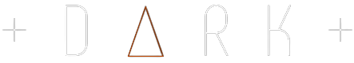
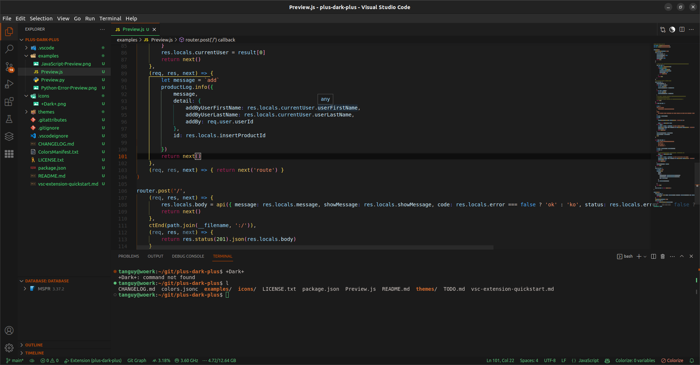
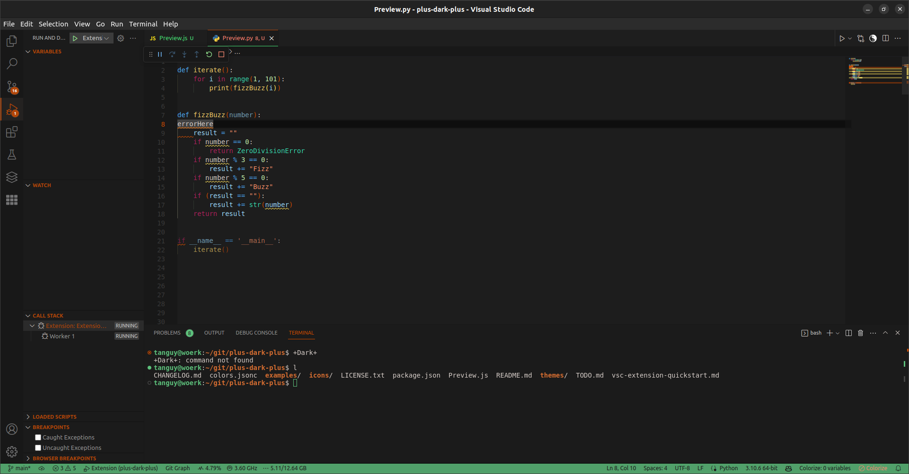

	

<h3 align="center">+An even darker theme for Visual Studio Code+</h3> 
<h3 align="center">With improved syntax highlight and aesthetics !  It also is a great base for your own custom theme, the config file is sorted and has the fullest choice of settings.</h3>

 
 
<h3 align="center">You can easily modify the primary colors such as the orange and green, as explained <a href="#custom">here</a> </h3> 
 

	<h2 align="center">Un-commited new JavaScript project example :</h2>
	

	<h2 align="center">Debugger view on a bad python program :</h2>
	

 
 

## Custom Theming

	Just replace every occurences of the following colors in the <code>~/.vscode/extensions/tanguydessoly.plus-dark-plus/themes/+Dark+-color-theme.json</code> config file and restart VSCode.
	
	Primary : 
		Orange #b34608
			StrongerVersion #cc4b00

	Secondary : 
		Green #5dc07b
			StrongerVersion #46df74 
				EvenStronger #43eb76

## My Links
<a href="https://www.linkedin.com/tanguydessoly" rel="nofollow noreferrer">
     LinkedIn
</a> &nbsp; 
<a href="https://github.com/tanguydessoly" rel="nofollow noreferrer">
     Github
</a>
 
 

